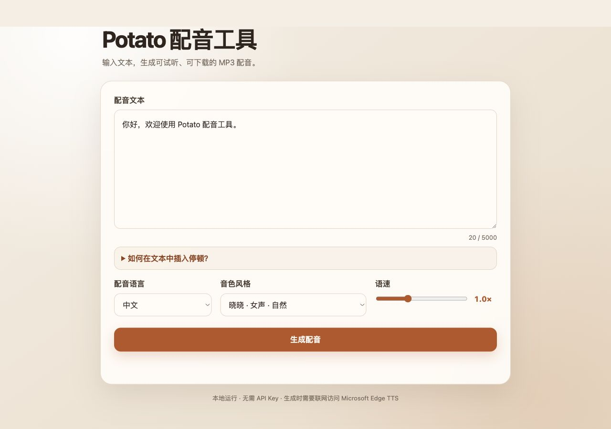

<div align="center">
  

  # Potato 配音工具

  **轻量、直观、无需 API Key 的本地网页配音工具**

  输入文本，选择语言和音色，即可生成可试听、可下载的 MP3 配音。

  <p>
    
    
    
    
  </p>
</div>

<p align="center">
  
</p>

## 为什么选择 Potato

| | 特性 | 说明 |
| --- | --- | --- |
| 🎙️ | 多语言配音 | 支持中文、英语、日语和韩语音色 |
| 🧑‍🎤 | 多种音色 | 提供自然、活泼、纪录片、新闻、故事等风格 |
| 🌍 | 自动翻译 | 选择外语音色时显示译文，并使用译文生成配音 |
| ⏱️ | 精确停顿 | 支持快捷停顿和毫秒级自定义停顿语法 |
| 🎚️ | 语速控制 | 可在 0.5×–2.0× 范围内调整语速 |
| 🔐 | 本地界面 | 无需申请 API Key，生成结果保存在本地 |

## 功能特性

- 在浏览器中输入和编辑最多 5000 个字符的配音文本
- 按语言筛选音色，避免不同语种混杂在同一列表
- 提供 15 种中、英、日、韩语音色
- 外语音色自动生成翻译预览，并保留停顿位置
- 在线试听生成结果并下载 MP3 文件
- Edge TTS 临时失败时自动重试
- 支持快捷停顿、精确停顿和停顿时长统计
- 响应式页面设计，可在桌面和移动浏览器使用

## 快速开始

### 环境要求

- Python 3.11 或更高版本
- [uv](https://docs.astral.sh/uv/) Python 包管理器
- 可访问 Microsoft Edge TTS 服务的网络连接
- FFmpeg（仅使用自定义停顿时需要）

### 安装并启动

```bash
git clone https://github.com/baiyazi/potato.git
cd potato
chmod +x start.sh
./start.sh
```

启动后会自动打开：

```text
http://127.0.0.1:8765
```

按 `Control+C` 停止本地服务。首次启动时，`uv` 会自动创建独立虚拟环境并安装依赖。

## 使用流程

1. 输入需要生成配音的文本。
2. 选择配音语言和音色风格。
3. 调整语速，并按需插入停顿标记。
4. 选择外语时检查自动生成的翻译预览。
5. 点击“生成配音”，完成后试听或下载 MP3。

生成文件默认保存在项目的 `outputs/` 目录中。

## 停顿语法

快捷写法：

| 标记 | 停顿时间 |
| --- | ---: |
| <code>&#124;</code> | 300ms |
| <code>&#124;&#124;</code> | 700ms |
| <code>&#124;&#124;&#124;</code> | 1.2s |

精确写法：

```text
大家好，[[pause:800ms]]今天介绍一个新工具。[[pause:1.5s]]让我们开始吧。
```

- `[[pause:800ms]]`：停顿 800 毫秒
- `[[pause:1.5s]]`：停顿 1.5 秒
- 单次停顿范围为 50ms–10s
- 最多使用 50 个停顿标记
- 全部停顿合计不能超过 60 秒
- 如需朗读 `|` 字符，请输入 `\|`

> 自定义停顿需要 FFmpeg。没有停顿标记时，生成普通配音无需 FFmpeg。

## 技术栈

- **Python 标准库 HTTP Server**：本地 Web 服务与接口
- **Edge TTS**：神经网络语音合成
- **MyMemory Translation API**：外语配音翻译预览
- **FFmpeg**：音频片段与精确静音合并
- **原生 HTML / CSS / JavaScript**：无需前端构建步骤
- **uv**：依赖与虚拟环境管理

## 项目结构

```text
potato/
├── app.py              # 本地 HTTP 服务与 API
├── tts.py              # 翻译、停顿解析与语音合成
├── index.html          # 单页 Web 界面
├── outputs/            # 生成的 MP3 文件
├── docs/assets/        # README 图标与界面截图
├── pyproject.toml      # Python 项目与依赖配置
├── uv.lock             # 可复现依赖锁定文件
└── start.sh            # 一键启动脚本
```

## 注意事项

- 页面和服务运行在本机，但语音合成与翻译需要联网。
- 合成内容会发送给 Microsoft Edge TTS；使用外语翻译时，文本片段还会发送给 MyMemory 翻译服务。
- `outputs/` 中的 MP3 文件默认不会提交到 Git 仓库。

---

<p align="center">
  如果 Potato 对你有帮助，欢迎 Star 支持。
</p>
